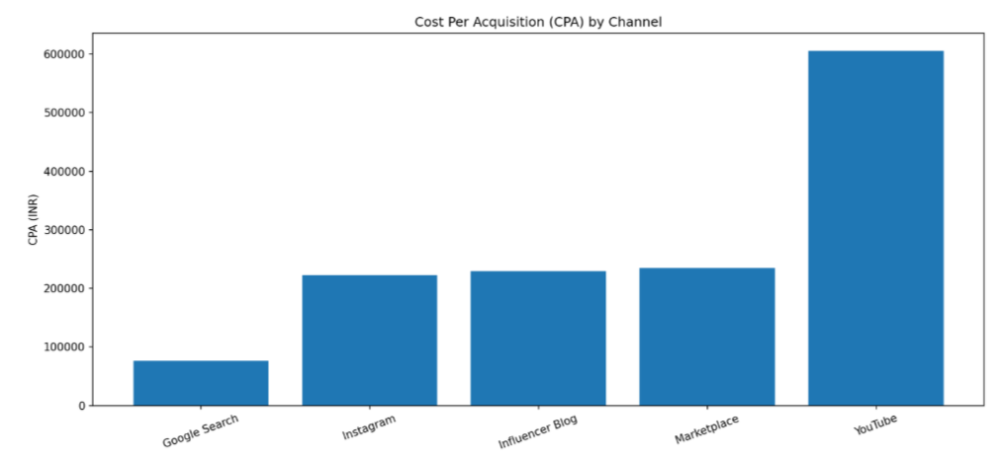
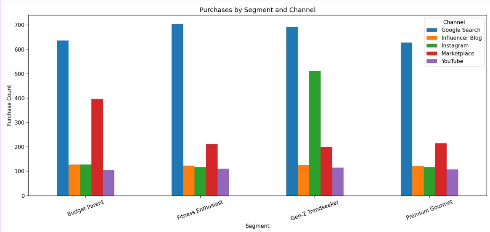
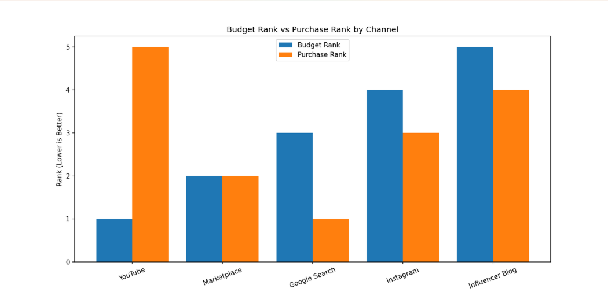

<p align="center">
  
</p>

<h1 align="center">ROI Lens: Marketing Spend Optimization</h1>

<p align="center">
A Data-Driven Marketing Analytics Case Study focused on Marketing Attribution, Customer Journey Analysis, and Budget Optimization.
</p>

<p align="center">


</p>
---

## 📌 Project Overview

**ROI Lens** is a marketing analytics case study focused on optimizing marketing spend using customer behavior and campaign performance data.

The project analyzes marketing channel effectiveness, customer segments, and attribution models to identify opportunities for improving return on investment (ROI) and making data-driven budget allocation decisions.

### Objectives

- Analyze customer purchase behavior across marketing channels
- Compare marketing channel performance using conversion metrics
- Evaluate Cost Per Acquisition (CPA)
- Identify high-performing customer segments
- Recommend optimized budget allocation strategies

  ---

## 🛠️ Tech Stack

| Category | Tools |
|----------|-------|
| Programming | Python |
| Data Analysis | Pandas, NumPy |
| Visualization | Matplotlib |
| Development | Jupyter Notebook |

---

## 📂 Repository Structure

```

├── images/
├── roi-lens-analysis.ipynb
├── project-presentation.pdf
├── certificate.jpeg
└── README.md

```
## 🎯 Business Problem

Businesses invest significant budgets across multiple marketing channels, but not every channel delivers the same return.

This project analyzes customer interactions and campaign performance to answer questions such as:

- Which marketing channel delivers the highest ROI?
- Which customer segments respond best?
- Is the current budget allocation efficient?
- How can marketing spend be optimized using data?

## 🔄 Methodology

The project followed the following workflow:

1. Data Cleaning
2. Exploratory Data Analysis (EDA)
3. Customer Segmentation
4. Channel Performance Analysis
5. Conversion Rate Analysis
6. Cost Per Acquisition (CPA)
7. Budget Optimization
8. Business Recommendations

## 📊 Cost Per Acquisition



Google Search achieved the lowest CPA, making it the most cost-efficient acquisition channel.

YouTube showed the highest CPA, suggesting lower efficiency and potential overinvestment.

## 📊 Purchases by Customer Segment



This visualization highlights how different customer segments respond to each marketing channel, enabling more targeted campaign strategies.

## 📊 Budget Allocation vs Performance



Comparing budget allocation with purchase performance reveals opportunities to redistribute marketing spend toward higher-performing channels.

## 💡 Recommendations

- Increase investment in Google Search campaigns.
- Re-evaluate YouTube spending due to high acquisition cost.
- Create personalized campaigns for Gen-Z customers.
- Use multi-touch attribution instead of relying solely on last-click attribution.

 ## 🚀 How to Run

```bash
git clone https://github.com/Nihi294/roi-lens-marketing-spend-optimization.git
```

```bash
pip install pandas numpy matplotlib
```

Open:

```text
roi-lens-analysis.ipynb
```

Run all notebook cells.

## 🔮 Future Improvements

- Build an interactive dashboard using Power BI or Tableau.
- Implement predictive marketing models.
- Add machine learning for budget forecasting.
- Automate report generation.

## 🙏 Acknowledgements

This project was completed as part of the Summer Project 2026 organized by E-Cell IIT Guwahati in collaboration with AI Palette.

## 📎 Project Resources

- 📓 [Jupyter Notebook](roi-lens-analysis.ipynb)
- 📑 [Project Presentation](roi-presentation.pdf)
- 🏅 [Certificate of Completion](certificate.jpeg)


## 👩‍💻 Author

**Nihira Singh**

Second-Year B.Tech Student

Interested in Product Management, AI, Data Analytics, and UI/UX Design.

Connect with me on [LinkedIn](https://www.linkedin.com/in/nihira-singh-b2907a377/)

## 📂 Dataset

The analysis is based on simulated marketing campaign and customer interaction data provided as part of the Summer Project 2026 case study.
