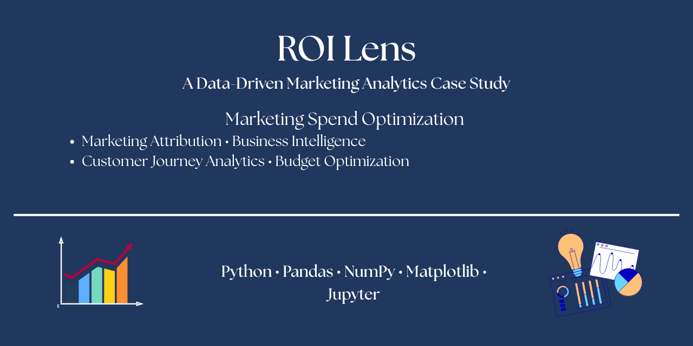

  

<h1 align="center">ROI Lens: Marketing Spend Optimization</h1>

A Data-Driven Marketing Analytics Case Study focused on Marketing Attribution, Customer Journey Analysis, and Budget Optimization.

